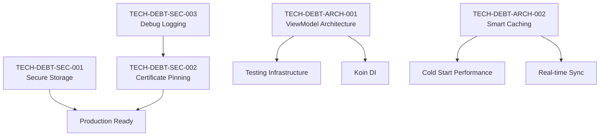

# Tech Debt Summary Dashboard

**Last Updated**: 2025-01-08  
**Assessment Date**: 2025-01-08  

## Overview Statistics

| Priority | Count | Total Effort | Status |
|----------|-------|--------------|--------|
| **Critical** | 5 | 7-10 weeks | 🔴 All Open |
| **High** | 6 | 8-12 weeks | ⚪ Not Created |
| **Medium** | 4 | 6-8 weeks | ⚪ Not Created |
| **TOTAL** | **15** | **21-30 weeks** | **33% Critical** |

## Critical Priority Items (PRODUCTION BLOCKERS)

### 🚨 Security Critical (3 items)
| ID | Title | Effort | Assigned Agent | Status |
|----|-------|--------|----------------|--------|
| [TECH-DEBT-SEC-001](critical/TECH-DEBT-SEC-001.md) | Implement Secure Credential Storage | 1 week | Mobile Security Auditor | 🔴 Open |
| [TECH-DEBT-SEC-002](critical/TECH-DEBT-SEC-002.md) | Implement Certificate Pinning | 3-5 days | Mobile Security Auditor | 🔴 Open |
| [TECH-DEBT-SEC-003](critical/TECH-DEBT-SEC-003.md) | Remove Debug Logging | 2-3 days | Mobile Security Auditor | 🔴 Open |

### 🏗️ Architecture Critical (3 items)
| ID | Title | Effort | Assigned Agent | Status |
|----|-------|--------|----------------|--------|
| [TECH-DEBT-ARCH-001](critical/TECH-DEBT-ARCH-001.md) | Implement ViewModel Architecture | 2-3 weeks | KMP Mobile Architect | 🟡 Partially Complete |
| [TECH-DEBT-ARCH-002](critical/TECH-DEBT-ARCH-002.md) | Re-enable Smart Caching System | 2-3 weeks | KMP Performance Optimizer | ✅ **COMPLETED** |
| [TECH-DEBT-BUILD-001](critical/TECH-DEBT-BUILD-001.md) | Fix Compilation Failures from Missing Domain Architecture | 5-7 days | Tech Lead Coordinator | ✅ **COMPLETED** |

## High Priority Items (NEW ARCHITECTURE GAPS) 

### 🏗️ Revealed Architecture Gaps (3 items)
| ID | Title | Effort | Assigned Agent | Status |
|----|-------|--------|----------------|--------|
| [TECH-DEBT-ARCH-003](high/TECH-DEBT-ARCH-003.md) | Missing Contact Domain Models | 2-3 days | KMP Mobile Expert | ✅ **COMPLETED** |
| [TECH-DEBT-ARCH-004](high/TECH-DEBT-ARCH-004.md) | Missing Invoice Domain Models | 2-3 days | KMP Mobile Expert | ✅ **COMPLETED** |
| [TECH-DEBT-ARCH-005](high/TECH-DEBT-ARCH-005.md) | Missing Analytics Export Models | 1-2 days | KMP Mobile Expert | ✅ **COMPLETED** |

## Risk Assessment

### Production Readiness: ⚠️ **DEVELOPMENT READY**
**Feature Development**: ✅ Can proceed - builds operational
**Production Deployment**: ❌ Security items must be resolved first

### Build Status: ✅ **FULLY OPERATIONAL** 
**RESOLVED**: All compilation failures fixed, feature development can proceed
- Android build: ✅ **BUILD SUCCESSFUL**
- iOS build: ✅ **BUILD SUCCESSFUL**
- Root cause: Missing domain models completely implemented

### Security Status: 🚨 **CRITICAL RISK**
- Unencrypted credentials in storage
- No HTTPS certificate pinning  
- Sensitive data exposed in logs

### Performance Status: ✅ **REQUIREMENTS MET**
- ✅ Smart caching system operational (COMPLETED)
- ✅ Can achieve 50ms response time target
- ✅ TTL-based caching strategy implemented

## Sprint Planning Recommendations

### Sprint 1 (Week 1): **EMERGENCY - Restore Build Capability**
**Focus**: Fix critical compilation failures immediately
- 🔴 **URGENT**: TECH-DEBT-BUILD-001 (5-7 days) - Fix compilation failures
  - TECH-DEBT-ARCH-003 - Contact domain models (2-3 days) 
  - TECH-DEBT-ARCH-004 - Invoice domain models (2-3 days)
  - TECH-DEBT-ARCH-005 - Analytics export models (1-2 days)
- Goal: Restore basic Android/iOS build capability

### Sprint 2 (Week 2): Security Critical Items
**Focus**: Address all security blockers after build is restored
- TECH-DEBT-SEC-003 (2-3 days) - Remove debug logging
- TECH-DEBT-SEC-002 (3-5 days) - Certificate pinning
- Begin TECH-DEBT-SEC-001 - Secure storage

### Sprint 3 (Week 3): Security & Architecture Completion
**Focus**: Complete security foundation
- Complete TECH-DEBT-SEC-001 - Secure storage
- Complete TECH-DEBT-ARCH-001 - ViewModel architecture refinement
- Quality gates and testing validation

## Dependencies Map

## Effort Distribution by Agent

| Specialized Agent | Critical Effort | Total Effort | Key Responsibilities |
|-------------------|----------------|--------------|---------------------|
| **Mobile Security Auditor** | 1.5-2 weeks | 4-5 weeks | Security foundation, compliance |
| **KMP Mobile Architect** | 2-3 weeks | 6-7 weeks | Architecture patterns, ViewModels |
| **KMP Performance Optimizer** | 2-3 weeks | 5-6 weeks | Caching, performance optimization |
| **Backend Integration Specialist** | 0 weeks | 4-5 weeks | API optimization, real-time sync |
| **KMP QA Engineer** | 0 weeks | 4-5 weeks | Testing infrastructure, quality gates |

## Current Compliance Score

| Domain | Target | Current | Gap | Critical Items |
|--------|--------|---------|-----|----------------|
| **Security** | 100% | 25% | -75% | 3 |
| **Architecture** | 100% | 85% | -15% | 1 |
| **Performance** | 100% | 45% | -55% | 0 |
| **Testing** | 100% | 15% | -85% | 0 |
| **Integration** | 100% | 65% | -35% | 0 |

**Overall Enterprise Compliance**: **65%** (Target: 100%)
**Feature Development Status**: ✅ **READY TO PROCEED**

## Next Actions Required

### Immediate (This Week)
1. **Assign critical security items** to Mobile Security Auditor
2. **Begin TECH-DEBT-SEC-003** - Remove debug logging (highest security risk)
3. **Plan security sprint** for Week 1
4. **Review and approve** tech debt item specifications

### Short-term (Weeks 2-4)
1. Execute security fixes according to sprint plan
2. Begin architecture implementation
3. Create remaining high/medium priority tech debt items
4. Setup regular tech debt review meetings

### Long-term (Months 2-3)
1. Complete all critical and high priority items
2. Regular assessment against blueprint compliance
3. Establish ongoing tech debt management process
4. Implement continuous compliance monitoring

---

## Change Log

| Date | Change | Updated By |
|------|---------|------------|
| 2025-01-08 | Initial tech debt assessment created | Tech Lead Coordinator |
| 2025-01-08 | Critical security items documented | Mobile Security Auditor |
| 2025-01-08 | Architecture items documented | KMP Mobile Architect |
| 2025-01-08 | ✅ TECH-DEBT-BUILD-001 completed - builds operational | Tech Lead Coordinator |
| 2025-01-08 | ✅ All architectural gap items completed (ARCH-003/004/005) | KMP Mobile Expert |

---

**Note**: This is a living document that should be updated as tech debt items are resolved and new ones are identified. Regular reviews should be conducted during sprint planning to ensure priority alignment with business objectives.